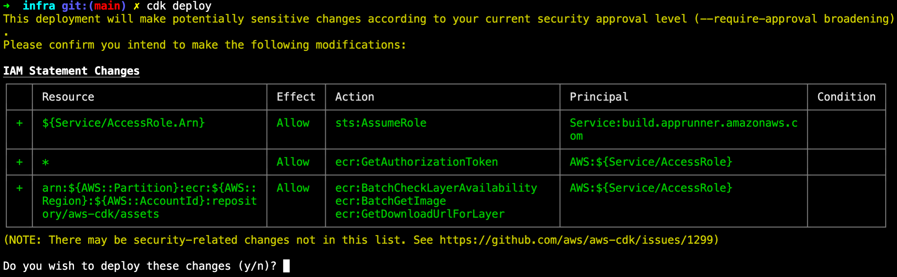
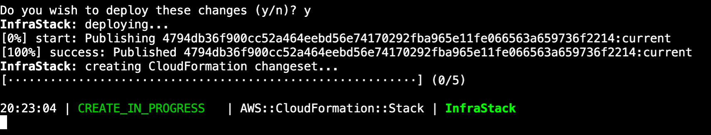
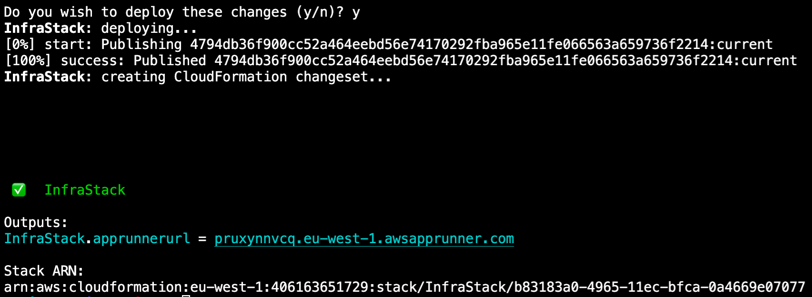

# Module 1: Deploy web application to AWS App Runner

## Introduction
In this module you will create a CDK application that will create all the necesary infrastructure to for AWS App Runner and deploy a sample container to it.

## What you will learn

- Create a simple CDK application
- Define an IAM policy and role to allow access to other services
- Deploy a container using App runner

## Implementation
At the end of this guide, the entire code example will be shown.

### Create the CDK app

First, ensure you have CDK installed (if you do not have it installed, please follow the [Getting Started with AWS CDK guide](https://github.com/aws-developer-center/getting-started-cdk/blob/main/README.md)):

```
cdk --verison
```

We will now create the skeleton CDK application using TypeScript as our language of choice:

```
mkdir infra
cd infra
cdk init app --language typescript
```

This will output the following:
~~~
Applying project template app for typescript
# Welcome to your CDK TypeScript project!

This is a blank project for TypeScript development with CDK.

The `cdk.json` file tells the CDK Toolkit how to execute your app.

## Useful commands

 * `npm run build`   compile typescript to js
 * `npm run watch`   watch for changes and compile
 * `npm run test`    perform the jest unit tests
 * `cdk deploy`      deploy this stack to your default AWS account/region
 * `cdk diff`        compare deployed stack with current state
 * `cdk synth`       emits the synthesized CloudFormation template

Executing npm install...
✅ All done!
~~~


### Create the code for the resource stack

Go to the file /lib/infra-stack.ts, this is where you will write the code for the resource stack you are going to create.

A _resource stack_ is a set of cloud infrastructure resources (in your particular case they will be all AWS resources), that will be provisioned into a specific account. The accont/region where these resources are provisioned, can be configured in the stack (as covered in the [Getting Started with AWS CDK guide](https://github.com/aws-developer-center/getting-started-cdk/blob/main/README.md).

In this resource stack, you are going to create the following resources:

- App Runner service: this is how your container will be run.

- Output: this will display the URL or your service.

### Deploy container service

To deploy your service, you first need to import the correct modules:

```
npm i @aws-cdk/aws-apprunner @aws-cdk/aws-ecr-assets
```

You will then edit the `lib/infra-stack.ts` file to add the dependencies at the top of the file:

```javascript
import apprunner = require('@aws-cdk/aws-apprunner'); // Allows working with App Runner resources
import assets = require('@aws-cdk/aws-ecr-assets'); // Allows building the docker image and uploading to ECR
import * as path from "path"; // Helper for working with file paths
```

These modules provide access to all the components you need for you to deploy the web application. 

Next, you will need to define which container to use. This is done by creating an App Runner service. For this guide, we will be building the container image provided with the sample application in `SampleApp` and have CDK manage the build, upload, and deployment of the container for us. We will also be creating an empty IAM role to attach to the service for future guides. To create the service and IAM role, add the following code:

```javascript
    // The code that defines your stack goes here

    //If you are running on a Mac using the new M1 chip, please change `../SampleApp` to `../../SampleApp`.
    const imageAsset = new assets.DockerImageAsset(this, 'ImageAssets', {
      directory: path.join(__dirname, '../SampleApp'),
    });

    const service = new apprunner.Service(this, 'Service', {
      source: apprunner.Source.fromAsset({
        imageConfiguration: { port: 80 },
        asset: imageAsset
      })
    });

    new cdk.CfnOutput(this, "apprunner-url", {
      exportName: "apprunner-url",
      value: service.serviceUrl,
      description: "URL to access service"
    });
```

In the code above, you created a service with App Runner to run a container that CDK will build from the `Dockerfile` in the `SampleApp` directory. Before you can use CDK, it needs to be bootstrapped - this will create the required infrastructure for CDK to manage infrastructure in your account. To bootstrap CDK, run `cdk bootstrap`. You should see output similar to:

```
⏳  Bootstrapping environment aws://0123456789012/<region>...
 ✅  Environment aws://0123456789012/<region> bootstrapped
```

Once the bootstrapping has completed, you will run `cdk deploy` to deploy the all the infrastructure required. And see output similar to the following:



CDK will prompt you before creating the infrastructure as it is creating infrastructure that changes security configuration - in your case, by creating IAM roles and security groups. Press `y` and then enter to deploy. CDK will now set up all the infrastructure you defined, and it will take a few minutes to complete. While it is running, you will see updates like this:



Once it completes, you will see output with the link to the public URL to access your service like this:



## Conclusion
In this module, we covered how to use AWS App Runner with AWS CDK to easily deploy a container on AWS. Before you close this guide, we recommend destroying the infrastructure you just created after you have finished testing it.

[Clean Up](cleanup.md)


## Full code sample
```javascript
import * as cdk from '@aws-cdk/core';
import apprunner = require('@aws-cdk/aws-apprunner'); // Allows working with App Runner resources
import assets = require('@aws-cdk/aws-ecr-assets'); // Allows building the docker image and uploading to ECR
import * as path from "path"; // Helper for working with file paths

export class InfraStack extends cdk.Stack {
  constructor(scope: cdk.Construct, id: string, props?: cdk.StackProps) {
    super(scope, id, props);

    // The code that defines your stack goes here
    const imageAsset = new assets.DockerImageAsset(this, 'ImageAssets', {
      directory: path.join(__dirname, '../../SampleApp/'),
    });

    const service = new apprunner.Service(this, 'Service', {
      source: apprunner.Source.fromAsset({
        imageConfiguration: { port: 80 },
        asset: imageAsset
      })
    });

    new cdk.CfnOutput(this, "apprunner-url", {
      exportName: "apprunner-url",
      value: service.serviceUrl,
      description: "URL to access service"
    });
  }
}
```